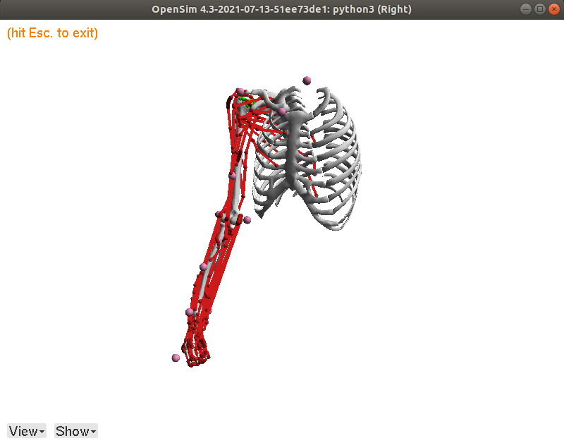
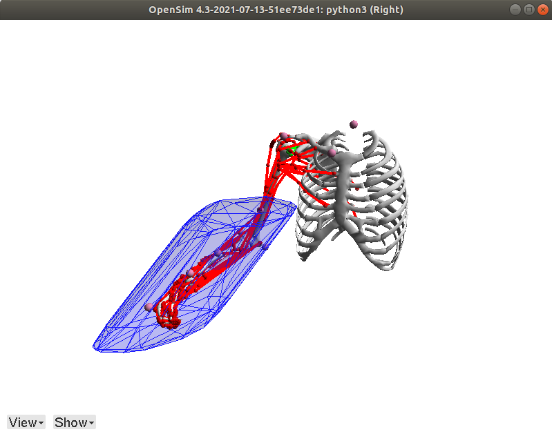

Opensim examples
==================


## Installing opensim

To install opensim follow the tutorial at their official github page [link](https://github.com/opensim-org/opensim-core).


## pyosim module downlaod

Installing a simple opensim python wrapper that implement useful functions to make your life easy when using opensim. It can be found using the [link](https://gitlab.inria.fr/auctus-team/components/modelisation/humanmodels/pyosim). 

You can download it using zip download directly from the link or by using terminal:

```bash
git clone https://gitlab.inria.fr/auctus-team/components/modelisation/humanmodels/pyosim.git
```

Make sure to put the downloaded folder to the same directory you will be writing your code in.
## Downloading opensim models

You will be able to use aany `.osim` model for the `pycapacity` package calculations, but to jump-start the development we suggest you to download our small model database on the [link](https://gitlab.inria.fr/auctus-team/components/modelisation/humanmodels/opensim_models). Either download it directly using zip download on the same link or using terminal:

```bash
git clone https://gitlab.inria.fr/auctus-team/components/modelisation/humanmodels/opensim_models.git
```

Make sure to put the downloaded folder to the same directory you will be writing your code in.


## Visualise models code example
A simple example to test that everything is installed well. You should be able to visualise different models by uncommenting different lines of this example.
```python
from pyosim.OsimModel import OsimModel

## uncomment for different models
# one arm
model_path = './opensim_models/upper_body/unimanual/MoBL-ARMS Upper Extremity Model/MOBL_ARMS_fixed_41.osim'
# model_path = './opensim_models/upper_body/unimanual/arm26.osim'
# model_path = './opensim_models/upper_body/unimanual/OSarm412.osim'
# model_path = './opensim_models/upper_body/unimanual/Wu_Shoulder_Model.osim'

# both arms
# model_path = './opensim_models/upper_body/bimanual/MoBL_ARMS_bimanual_6_2_21.osim'
# model_path = './opensim_models/upper_body/bimanual/full_upper_body_marks.osim'

# full body
# model_path = './opensim_models/full_body/gait2392_simbody.osim'

# lower bodyy
# model_path = './opensim_models/lower_body/leg6dof9musc.osim'

## Constructor of the OsimModel class.
OsimModel(model_path,visualize=True).displayModel()

```



## Code example 

```python
# include the pyosim module
from pyosim.OsimModel import OsimModel

# include opensim package
import opensim as osim

# pycappacity for polytope calculationreate the 
from pycapacity.human import force_polytope as polytope

# some utils 
import numpy as np
import time

## Constructor of the OsimModel class.
OS_model = OsimModel("opensim_models/upper_body/unimanual/MoBL-ARMS Upper Extremity Model/MOBL_ARMS_fixed_41.osim", visualize=True)

start = time.time()
joint_pos = [0,0.5,0,1.3,0,1.0,0.0]
OS_model.setJointValues(joint_pos)

# find unconstrained joint only
real_dof = []
for i, joint in enumerate(OS_model.osimModel.getCoordinateSet()):
    if not joint.isConstrained(OS_model.osimState):
        real_dof.append(i)
print(real_dof)
 
start = time.time()
J = OS_model.getJacobian( n=11 )
# only position jacobian
J = J[-3:,real_dof]
N = OS_model.getMomentArm(real_dof)

# force limits 
F_min, F_max = OS_model.getForceLimits()
print(F_max)
print("time", time.time() - start)

# polytope calculation
start = time.time()
f_vert, H, d, faces_indexes = polytope(J, N, F_min, F_max, 5)
print("time", time.time() - start)
print(f_vert.shape)

# find hand position
hand_position = OS_model.getBodiesPositions()['hand'][1]
# create the polytope
import trimesh
mesh = trimesh.Trimesh(vertices=(f_vert.T/2000 + hand_position.reshape((3,))) ,
                       faces=faces_indexes,  use_embree=True, validate=True)
# save polytope as stl file
f = open("polytope.stl", "wb")
f.write(trimesh.exchange.stl.export_stl(mesh))
f.close()

# adding polytope faces 
mesh = osim.Mesh("./polytope.stl")
OS_model.osimModel.get_ground().attachGeometry(mesh)
mesh.setColor(osim.Vec3(0.1,0.1,1))
mesh.setOpacity(0.3)
# adding polytope vireframe
mesh = osim.Mesh("./polytope.stl")
OS_model.osimModel.get_ground().attachGeometry(mesh)
mesh.setColor(osim.Vec3(0.1,0.1,1))
mesh.setRepresentation(2)

# re-init the model
OS_model.osimModel.initSystem()
OS_model.setJointValues(joint_pos)

# visualise the model
OS_model.simulateModel()
```
